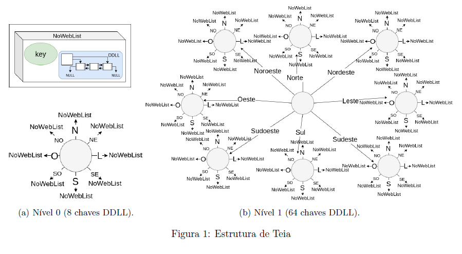
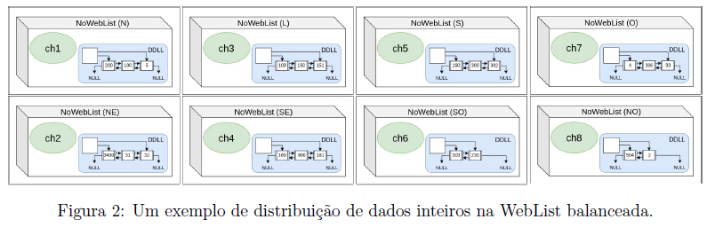

# WebList - Teia de Listas em Árvore Octógona

Este repositório contém o código e a documentação para a estrutura de dados denominada **WebList**. A **WebList** é uma variação de árvore em que o nó raiz é o nó central da teia, formando uma árvore octógona completa, cheia e estática. Esta estrutura foi desenvolvida com o objetivo de consolidar o conhecimento sobre árvores e aplicar esses conceitos a uma nova estrutura adaptada.

## Visão Geral

A **WebList** é uma estrutura de árvore com as seguintes características:

- **Homogeneidade**: O tipo dos dados é único e definido na criação da estrutura.
- **Balanceamento**: A soma do número de dados incluídos nas listas ligadas duplamente dinâmicas (DDLLs) por nó da árvore não pode variar mais do que 1 elemento.
- **Generalidade**: Qualquer dado que possua uma regra de precedência pode ser armazenado na estrutura.



A **WebList** é composta por várias operações que permitem a construção, destruição, acesso e manipulação dos dados armazenados. Essas operações estão descritas na API pública, conforme mostrado abaixo.

## API Pública da WebList

```c
#define SUCCESS 0
#define FAIL -1

typedef struct weblist *pweblist , **ppweblist;

// Funções operacionais
int cWL (...); // criar a estrutura
int dWL (...); // destruir a estrutura

// Funções focadas nos dados
int iDado (...); // inserir um novo dado na estrutura
int rDado (...); // remover um dado da estrutura
int bDado (...); // buscar um dado na estrutura
int pLista (...); // percorrer a lista de dados

// Funções focadas nos nós-folha
int cpLista (..., int chave , ppDDLL retorno); // retornar uma cópia da DDLL correspondente a chave
int sbLista (..., int chave , pDDLL novaLista); // substituir a lista DDLL correspondente a chave pela lista recebida
int rmLista (..., int chave , ppDDLL rmLista); // remover a lista DDLL correspondente a chave
int nvLista (..., int chave); // criar uma DDLL vazia para a chave recebida

// Funções da WebList
int nroEleNoFolha (..., int* retorno); // retornar o número de elementos em um nó-folha
int nroNoFolha (..., int* retorno); // retornar o número total de nós-folha
int nroEleWL (..., int* retorno); // retornar o número total de elementos cadastrados
int lstChaves (..., ppDDLL retorno); // retornar uma lista com todas as chaves da WebList
int WLbalanceada (...); // verificar se a WebList está balanceada
```

## Exemplos de Uso

A entrada dos dados é realizada por meio da leitura de um arquivo passado como parâmetro, por exemplo:

```sh
./main.exe dados1.in
./main.exe dados2.in
```

Os arquivos de entrada devem estar no formato de texto, com os dados separados por espaços. Veja um exemplo de arquivo de entrada:

```txt
20007 16597 3641 16140
8622 29947 9148
13861 27783
6104 12185 8843
```



## Procedimentos do Trabalho Final

Este projeto foi dividido em duas etapas:

1. **Desenvolvimento da biblioteca WebList**: Esta fase foi realizada em duplas, de forma assíncrona.
2. **Adequação da WebList**: Esta fase foi individual e contou com o desenvolvimento em sala de aula.

O foco principal foi a elaboração de algoritmos com complexidades assintóticas eficientes, e a comparação das soluções entre diferentes equipes.

## Contribuição

Contribuições são bem-vindas! Sinta-se à vontade para abrir uma *issue* ou enviar um *pull request*.

## Licença

Este projeto está sob a licença MIT. Veja o arquivo [LICENSE](LICENSE) para mais detalhes.

